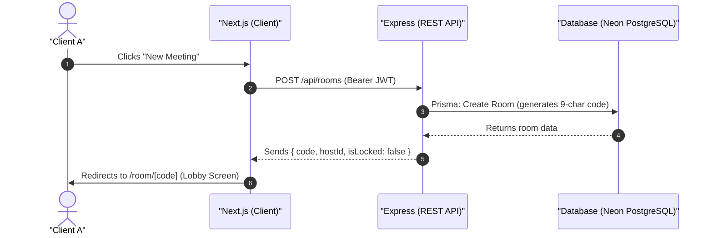
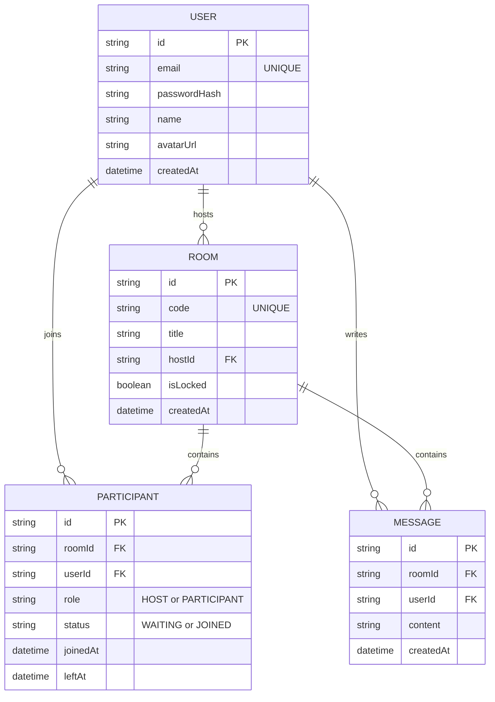

# 🌐 Collabrix — Complete Project Architecture & Walkthrough

This document provides a precise, highly detailed architectural blueprint of the **Collabrix** video conferencing platform. It explains the codebase structure, database design, technology integrations, and step-by-step runtime operations.

---

## 🛠️ Core Technology Stack

Collabrix is built on a decoupled, production-grade JavaScript/TypeScript monorepo architecture:

| Component | Technology | Description |
| :--- | :--- | :--- |
| **Languages** | **TypeScript (ES2022)** | Strong typing across both client and server domains. |
| **Frontend Framework** | **Next.js App Router (React 19)** | Server-side rendering (SSR), optimized layouts, and modular client-side state. |
| **Client State Management** | **Zustand** | Decentralized, highly reactive state management (auth and active room states). |
| **Styling & Animation** | **Tailwind CSS & Framer Motion** | Fast utility styling and fluid transition layers. |
| **Real-time WebSockets** | **Socket.IO (v4)** | Dual HTTP polling/WebSocket failover signaling channels. |
| **Media Streams** | **WebRTC Native Browser APIs** | High-definition P2P audio, video, and display media tracks. |
| **Backend Service** | **Node.js & Express** | JWT authentication, room REST APIs, and signaling orchestrations. |
| **Database & ORM** | **PostgreSQL & Prisma ORM** | Schema validation, type-safe queries, and clean db migrations. |
| **Horizontal Scaling** | **Redis Pub/Sub (Socket.IO adapter)** | Synchronizes server events across multiple stateless server nodes. |

---

## 🔄 How it Works: Step-by-Step System Flow

Collabrix orchestrates real-time communication by combining REST APIs (for persistent state) with WebSockets (for signaling) and WebRTC (for media streams).

### 1. The Room Creation & Entry Flow



1. **Authentication**: Users must log in or sign up. They receive a **JSON Web Token (JWT)**, which is stored in `localStorage` and sent in the HTTP `Authorization` headers.
2. **Room Creation**: A user hits the `/api/rooms` endpoint. Express writes a new `Room` record to the database with a unique code (e.g. `abc-defg-hij`).
3. **Lobby Entrance**: The user lands in a "Lobby" interface. They choose their audio/video input devices, configure camera permissions, and enter the active room.

---

### 2. The WebRTC Signaling & Connection Flow

WebRTC requires **Signaling** to let peer browsers exchange network locations (IP/ports) and device capabilities (codecs). This is handled via Socket.IO.

```mermaid
sequenceDiagram
    autonumber
    actor PeerA as "Peer A (Host)"
    participant Server as "Socket.IO Server"
    actor PeerB as "Peer B (Joiner)"

    PeerA->>Server: join-room { code } (Subscribes to Room socket channel)
    PeerB->>Server: join-room { code }
    Server-->>PeerA: Emit "peer-joined" { peerId: PeerB }
    
    Note over PeerA, PeerB: WebRTC Negotiation Begins
    PeerA->>PeerA: Create RTCPeerConnection & add local tracks
    PeerA->>PeerA: pc.createOffer() -> Set Local SDP Description
    PeerA->>Server: Emit "signal" { to: PeerB, type: "offer", sdp }
    Server-->>PeerB: Forward "signal" { from: PeerA, type: "offer", sdp }
    
    PeerB->>PeerB: pc.setRemoteDescription(offerSDP)
    PeerB->>PeerB: Create RTCPeerConnection & add local tracks
    PeerB->>PeerB: pc.createAnswer() -> Set Local SDP Description
    PeerB->>Server: Emit "signal" { to: PeerA, type: "answer", sdp }
    Server-->>PeerA: Forward "signal" { from: PeerB, type: "answer", sdp }
    
    Note over PeerA, PeerB: ICE Candidate Gathering
    PeerA-xServer: Emit "signal" { to: PeerB, type: "ice-candidate", candidate }
    Server-->>PeerB: Forward "signal" { from: PeerA, type: "ice-candidate", candidate }
    PeerB->>PeerB: pc.addIceCandidate(candidate)
    
    Note over PeerA, PeerB: Direct Connection Established
    PeerA<--->PeerB: P2P Audio & Video Streams (WebRTC Bypass Server)
```

1. **Socket Room Subscription**: When a user enters a room, they emit `join-room`. The server adds their socket to a room channel.
2. **Peer Notification**: The server tells existing participants in the room that a new peer has joined (`peer-joined`).
3. **Offer Generation**: The initiator (e.g. Peer A) creates an `RTCPeerConnection` instance, gathers local media tracks, creates an **SDP Offer**, and sends it to the server.
4. **Offer Relay**: The server relays the SDP Offer to the target peer (e.g. Peer B).
5. **Answer Generation**: Peer B receives the offer, sets it as their remote description, attaches their own local tracks, generates an **SDP Answer**, and sends it back through the server to Peer A.
6. **ICE Candidates Exchange**: While negotiation occurs, both browsers gather **ICE Candidates** (public IP addresses and ports mapped via STUN servers) and exchange them.
7. **Direct Connection**: Once paths are optimized and descriptions are set, the peer-to-peer connection is established. Audio/video data bypasses the server and streams directly between the browsers.

---

### 3. Core Features In-Action

#### A. Active Speaker Detection (Web Audio API)
Every participant's microphone stream is piped to a browser `AudioContext`.
* Inside `useActiveSpeaker.ts`, an `AnalyserNode` evaluates the sound frequency and decibel output every **100ms**.
* If the root-mean-square (RMS) volume level spikes above a noise floor (e.g., threshold `-50dB`), the client updates its local state.
* The speaker's name/state is broadcasted to all peers via Socket.IO, triggering a glowing outline around their video feed.

#### B. Dynamic Screen Sharing (`replaceTrack`)
When a user clicks "Share Screen":
1. The client invokes `navigator.mediaDevices.getDisplayMedia({ video: true })` to capture screen frames.
2. Instead of breaking the peer connection and building a new SDP connection, it iterates over all active `RTCPeerConnection` instances.
3. It finds the video track sender (`RTCRtpSender`) and calls `sender.replaceTrack(screenTrack)`.
4. This instantly updates the video source on all peers' screens without renegotiating or disrupting audio streams.
5. On stop, it replaces the screen track back with the camera track.

#### C. Developer Diagnostics Overlay
Clicking the bug icon triggers real-time network evaluation:
* It polls the `pc.getStats()` API every 3 seconds.
* It extracts network health data: **Round Trip Time (RTT)**, **Packet Loss** ratio, current **Bitrate (kbps)**, and rendering **Frames Per Second (FPS)**.
* Displays the graphs on a slide-out drawer so users can debug lag spikes or dropouts.

---

## 🗄️ Database Schema Design (Prisma / PostgreSQL)

The backend schema contains four primary models mapping users, meetings, room state, and chat history:



*   **User**: Represents individual profiles. Has one-to-many relationships with `Room` (hosted rooms), `Participant` (session logs), and `Message` (chat logs).
*   **Room**: Manages meetings. Keeps track of the `hostId`, locks status (lobby waiting lists), and references active/inactive participants and messages.
*   **Participant**: Acts as a junction table tracking user entry logs. When a user requests entry, their status is set to `WAITING` until approved by the host, after which it changes to `JOINED`.
*   **Message**: Tracks chat history inside the meeting, allowing persistent storage of conversations during calls.

---

## 📁 Detailed Directory Structure

Below is the directory tree mapping the files and services:

```
gmeetclone/
├── backend/
│   ├── prisma/
│   │   └── schema.prisma             # PostgreSQL database schemas
│   ├── src/
│   │   ├── config/
│   │   │   ├── db.ts                 # Prisma Client bootstrapper & shutdown hook
│   │   │   ├── env.ts                # Zod environment variable validator
│   │   │   └── redis.ts              # Redis client configurations (Pub/Sub)
│   │   ├── controllers/
│   │   │   ├── auth.controller.ts    # Sign up, Log in, Log out, Me endpoints
│   │   │   └── room.controller.ts    # Room creation, validation, lock handlers
│   │   ├── middleware/
│   │   │   ├── auth.middleware.ts    # JWT verification & extraction
│   │   │   └── error.middleware.ts   # Express request error boundaries
│   │   ├── routes/
│   │   │   ├── auth.routes.ts        # Map /api/auth routes
│   │   │   ├── room.routes.ts        # Map /api/rooms routes
│   │   │   └── index.ts              # Root routing aggregation
│   │   ├── services/
│   │   │   ├── auth.service.ts       # Password hashing & JWT signing
│   │   │   └── room-state.service.ts # Redis-based in-memory participant/room states
│   │   ├── sockets/
│   │   │   └── index.ts              # Main Socket.IO signaling event listener
│   │   ├── utils/
│   │   │   └── logger.ts             # Custom winston/formatted console log helper
│   │   ├── index.ts                  # Server entry & Socket.IO initialization
│   │   └── server.ts                 # Express configuration (CORS, Middlewares, Helmet)
│   ├── Dockerfile                    # Containerization instructions
│   └── package.json                  # Backend dependencies & build scripts
├── frontend/
│   ├── public/                       # Static browser files & logos
│   ├── src/
│   │   ├── app/                      # Next.js App Router structure
│   │   │   ├── login/
│   │   │   │   └── page.tsx          # Login view page
│   │   │   ├── signup/
│   │   │   │   └── page.tsx          # Signup view page
│   │   │   ├── room/
│   │   │   │   └── [code]/
│   │   │   │       └── page.tsx      # Main layout for Lobby & Active Rooms
│   │   │   ├── globals.css           # Core styling tokens & CSS imports
│   │   │   ├── layout.tsx            # Global HTML wrapper
│   │   │   └── page.tsx              # Landing homepage
│   │   ├── components/
│   │   │   ├── AuthInitializer.tsx   # REST cookie validator/authenticator hook
│   │   │   ├── DebugPanel.tsx        # Developer overlay parsing RTCPeerConnection statistics
│   │   │   ├── Lobby.tsx             # Pre-meeting join permissions & mic/cam setup UI
│   │   │   ├── MeetingControls.tsx   # Control drawer (Mute, Camera toggle, Share, Leave, Bug overlay)
│   │   │   ├── SidePanel.tsx         # Sidebar for in-app chat, participants lists, & lobby requests
│   │   │   └── VideoGrid.tsx         # Auto-fitting layout for user video streams
│   │   ├── hooks/
│   │   │   ├── useActiveSpeaker.ts   # Web Audio API monitoring node
│   │   │   ├── useDevices.ts         # Camera/microphone listing & default hooks
│   │   │   └── useWebRTC.ts          # Core WebRTC connection signaling loops & events
│   │   ├── services/
│   │   │   ├── api.ts                # Axios-equivalent custom fetch/REST endpoints wrapper
│   │   │   └── socket.ts             # Socket.IO client connection manager
│   │   └── store/
│   │   │   ├── useAuthStore.ts       # Zustand auth data storage
│   │   │   └── useRoomStore.ts       # Zustand room parameters, chat list, & video states
│   │   └── tsconfig.json             # Frontend compiler rules
│   ├── Dockerfile                    # Frontend container build definitions
│   └── package.json                  # Next.js scripts & dependency definitions
```

---

## 📈 Scalability & Network Optimizations

To handle load, the codebase employs production-ready strategies:

1. **State Partitioning**: Active participant states (who has muted mic, toggled camera, joined/left) do not write to PostgreSQL. They are stored inside in-memory cache hashes in Redis. This reduces PostgreSQL read/write query load to practically zero during meetings.
2. **Single Connection WebRTC (Mesh vs SFU)**:
   * *Current State*: The platform currently uses a **Mesh (P2P)** topology. Every peer establishes a direct channel to every other peer ($N(N-1)/2$ connections).
   * *SFU Ready*: The code has modular abstraction handlers (`useWebRTC.ts`) design. This enables easy integration of an SFU container (like *Mediasoup* or *Pion*) to receive streams and broadcast to receivers, avoiding network limits for bigger meetings.
3. **Graceful Failover**: If the WebSocket connection drops, Socket.IO automatically attempts reconnection over standard HTTP Polling fallback, restoring WebRTC connections on connection resumption.
